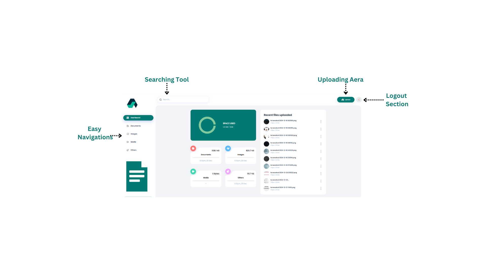

# 🚀 Storage and File Sharing Platform  

 


A robust **Storage and File Sharing Platform** built to manage, organize, and share files with ease. This platform includes user authentication via OTP, file upload/download, and a sleek dashboard for file management.  

---  

## 📋 Table of Contents  
- 🤖 [Introduction](#introduction)  
- 📸 [Screenshots](#screenshots)  
- ⚙️ [Tech Stack](#tech-stack)  
- 🔋 [Features](#features)  
- 🤸 [Quick Start](#quick-start)  
- 🕸️ [Code Snippets](#code-snippets)  
- 🔗 [Resources](#resources)  
- 🚀 [More Features](#more-features)  

---  

## 🤖 Introduction  
This project is a **Storage and File Sharing Platform** designed to:  
- Enable secure **login/signup** with OTP-based authentication.  
- Allow users to **upload, manage, delete, share, and edit files**.  
- Provide a dynamic **dashboard** showcasing file insights and recent activities.  

The platform is built with modern technologies like **React.js**, **Next.js 15**, and **Appwrite SDK**, ensuring a fast and responsive user experience.  

---  

## 📸 Screenshots  

### Website Screenshots  
| Authentication Pages  
  
|  
|  |  
|  |  |  
|  | 

 | Main Dashboard Pages |


---  

## ⚙️ Tech Stack  
- **Frontend**: React 19, Next.js 15, TailwindCSS, ShadCN  
- **Backend**: Appwrite SDK, Node.js  
- **Language**: TypeScript  

---  

## 🔋 Features  

### Core Features:  
- **User Authentication**: OTP-based login and signup using Appwrite.  
- **File Management**: Upload, rename, delete, and download files effortlessly.  
- **File Sharing**: Generate shareable links for easy collaboration.  
- **Dashboard**:  
  - Visualize storage usage.  
  - Access recent uploads.  
  - View file summaries by type.  
- **Search & Sort**: Quickly locate files with global search and sorting options.  

### Design Features:  
- **Responsive Design**: Optimized for both desktop and mobile devices.  
- **Clean UI**: Built with TailwindCSS for a modern, minimalist look.  

---  

## 🤸 Quick Start  

### Prerequisites  
Ensure you have the following installed:  
- Git  
- Node.js  
- npm  

### Clone the Repository  
```bash  
git clone https://github.com/your-username/storage-and-file-sharing-platform.git  
cd storage-and-file-sharing-platform  
```
```bash
git clone https://github.com/your-username/storage-and-file-sharing-platform.git
cd storage-and-file-sharing-platform
```
Install Dependencies

```bash

npm install
```
Set Up Environment Variables
Create a .env.local file in the root directory and add the following:

```bash
env

NEXT_PUBLIC_APPWRITE_ENDPOINT="https://cloud.appwrite.io/v1"
NEXT_PUBLIC_APPWRITE_PROJECT="your-appwrite-project-id"
NEXT_PUBLIC_APPWRITE_DATABASE="your-database-id"
NEXT_PUBLIC_APPWRITE_USERS_COLLECTION="your-users-collection-id"
NEXT_PUBLIC_APPWRITE_FILES_COLLECTION="your-files-collection-id"
NEXT_PUBLIC_APPWRITE_BUCKET="your-storage-bucket-id"
NEXT_APPWRITE_KEY="your-appwrite-api-key"

```
Replace the placeholder values with your actual Appwrite credentials.

Run the Development Server
```bash

npm run dev

```

Open http://localhost:3000 in your browser to see the application.

🕸️ Code Snippets
Here are some important code snippets:

### Code Screenshots  
| Key Snippets |  
|--------------|  
|  |  
|  |  
|  |  


